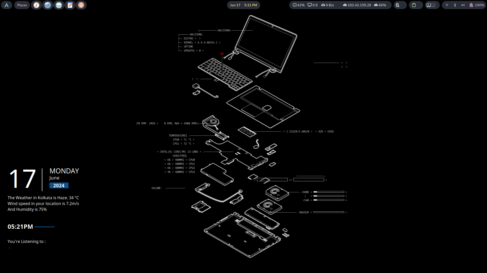
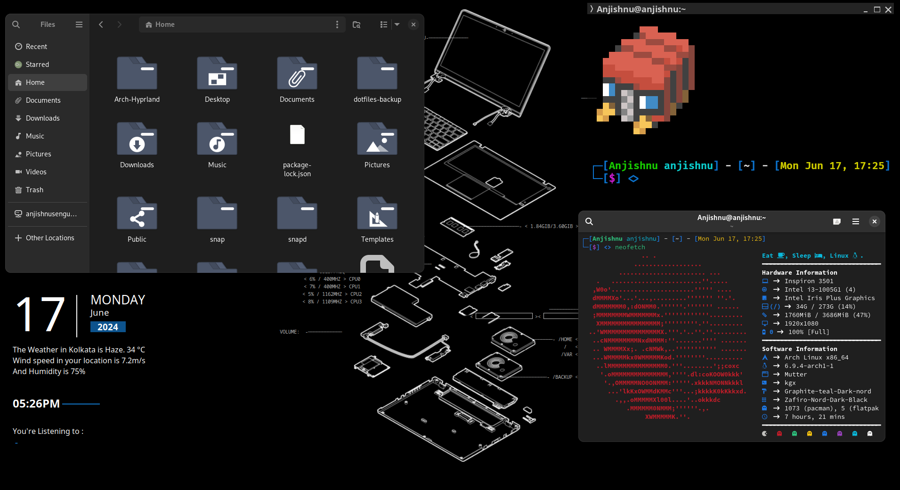

<div align="center">
<br>
  

  <a href="#-announcement-"><kbd> <br> Read this First <br> </kbd></a>&ensp;&ensp;
  <a href="#installation"><kbd> <br> Installation <br> </kbd></a>&ensp;&ensp;
  <a href="#gallery"><kbd> <br> Gallery <br> </kbd></a>&ensp;&ensp;
 </div><br>

<div align="center">


<a href="https://discord.gg/whE6mhEt2b"> </a><br>


</div>

##

<h3 align="center">
 
 Gnome Customization Showcase
 
</h3>

### Gallery

<details>
<summary>
<b>Screenshots<b>
</summary>
<p align="center">
    
    
</p>
</details>

### 🪧🪧🪧 ANNOUNCEMENT 🪧🪧🪧

- This Repo is a collection and stack of themes, icons and wallpaper created by other developers. Some of the conky theme is updated to achieve the configuration and look of the desktop.

> \[!IMPORTANT]
>
> **Star Us**, You will receive all release notifications from GitHub without any delay \~ ⭐️

<details>
  <summary><kbd>Star History</kbd></summary>

<a href="https://star-history.com/#OnePunchMan2718/Linux-Setup&Date">
 <picture>
   <source media="(prefers-color-scheme: dark)" srcset="https://api.star-history.com/svg?repos=OnePunchMan2718/Linux-Setup&type=Date&theme=dark" />
   <source media="(prefers-color-scheme: light)" srcset="https://api.star-history.com/svg?repos=OnePunchMan2718/Linux-Setup&type=Date" />
   
 </picture>
</a>
</details>

<div style="border: 1px solid blue; padding: 10px;">
  <strong>
    <b><font color="sky blue">Note:</font></b>&ensp;<small>The Creators of the themes, icons & other packs used in this Customization has been mentioned later.</small>
  </strong>
</div>
<br>
<div style="border: 1px solid red; padding: 10px;">
  <strong>
    <b><font color="yellow">Warning:</font></b>&ensp;<small>The Conky Theme is somewhat broken in some parts. It may likely do to my system or the file is broken.&ensp;<font color="sky blue">It would be generous if anybody helps, please checkout the</font><a href="https://github.com/OnePunchMan2718/Linux-Setup/how-to-contribute.md">  </a></small>
  </strong>
</div>

## ✨ Installation

```bash
git clone https://github.com/OnePunchMan2718/Linux-Setup.git
cd Linux-Setup
ls -l
- (For Verification)
```

### After Installation It Should Look Like This

<p align="center">
    

### Distro Installation

<details>
<summary>
<b>Arch Linux<b>
</summary>
<p>
<pre><code>

sudo pacman -Syu

sudo pacman -S neofetch zsh lua conky-all jq curl gnome-tweaks chrome-gnome-shell powerline-fonts

zsh --version
whereis zsh
sh -c "$(curl -fsSL https://raw.github.com/robbyrussel/oh-my-zsh/master/tools/install.sh)"

conky
pgrep conky
kill [number]

neofetch

yay -S pokemon-colorscripts-git
pokemon-colorscripts -h
pokemon-colorscripts -r -s
</code></pre>
</p>
</details>

## Common Errors

### ZSH and OH-MY-ZSH installation

If zsh not working properly only then run these commands:

```bash
chsh -s $(which zsh)
zsh
source ~/.zshrc
```

- reboot or logout
- by default agnoster theme is installed. You can find more themes from this [`OH-MY-ZSH-THEMES`](https://github.com/ohmyzsh/ohmyzsh/wiki/Themes)
- to change the theme, edit ~/.zshrc . Look for ZSH_THEME="desired theme"
